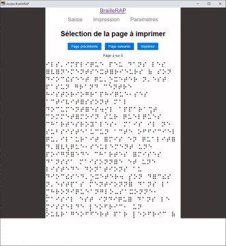

# AccessBrailleRAP
Braille transcription software for BrailleRAP. NVDA compatible.


# Screenshot



# How to install
Install Chrome.

Install BrailleRAP [drivers](https://braillerap.readthedocs.io/fr/latest/drivers_mks.html).

Run the application AccesBrailleRAP.exe.


Environnement Install (Windows)
=====================

You'll need to have Chrome  installed.

You’ll need to have Python >= 3.6, Eel, pyinstaller, pySerial...


First make a python virtual env in a power shell.
```
$ python -m venv venv 
```

Activate the virtual env (power shell)
```
$ .\venv\Scripts\activate.ps1  
```

Install all python depencies with:
```
$ pip install -r requirement.txt 
```

Install all react/js dependencies
```
$ yarn install
```

Develop on React GUI
====================

```
$ yarn start
```

Build as GUI App
================

```
$ yarn build
```

check `dist/AccessBrailleRAP.exe`


# 📋 About this fork

Cette "fork" a pour objectif l'ajout d'un module de reconnaissance vocale afin de permettre à l'utilisateur de pouvoir lancer l'impression sans interaction avec l'interface de l'application. Pour le moment, cela se fait avec l'API Web Speech en JavaScript.
